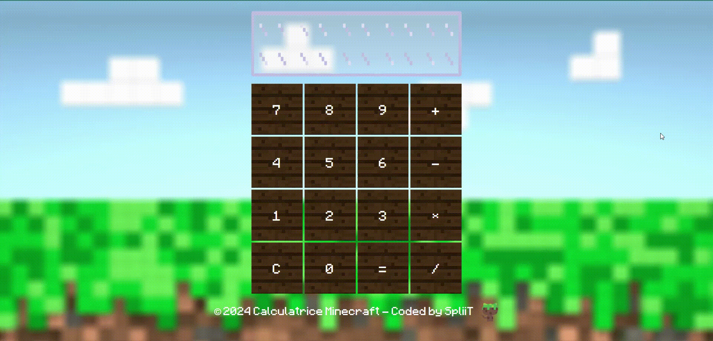

# Calculatrice Minecraft

## Description

Cette calculatrice sous le thème du célèbre jeu Minecraft a été réalisé dans le cadre d'un projet pour La Fabrique Numérique.

## Fonctionnalités

- Calculatrice basique
- Possibilité d'utiliser les touches du clavier pour intéragir avec la calculatrice

## Technologies Utilisées

- HTML5
- CSS3
- JavaScript

## Installation

1. Clonez le dépôt : `git clone https://github.com/SpliiT/Calculatrice-Minecraft.git`
2. Ouvrez le fichier `index.html` dans votre navigateur web préféré à l'aide d'un serveur local.

Vous pouvez également retrouver mon projet en ligne en suivant ce lien : 
https://minecraft-calculatrice.netlify.app/

## Utilisation

- Lancez la calculatrice dans votre navigateur et calculez ! 
